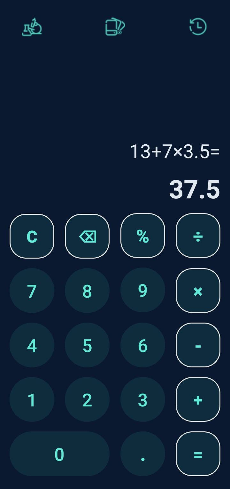
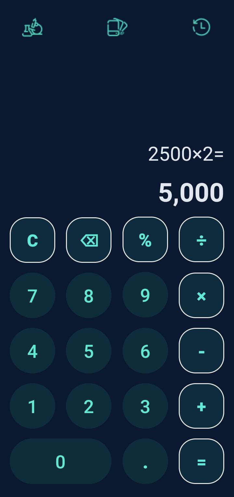

# CalculatorApp

A simple calculator app developed in Android Studio using Kotlin, following the Model-View-Controller (MVC) architecture.

## Introduction

This calculator app provides basic arithmetic operations. It also supports decimal numbers and percentage calculations. The app is designed with a user-friendly interface for easy interaction. 

## Features     

- Addition (+)
- Subtraction (-)
- Multiplication (×)
- Division (÷)
- Percentage (%)
- Clear (AC)
- Backspace (←)
- Preview Text for previous operations

## Architecture

The app follows the Model-View-Controller architecture:

- **Model**: Contains the business logic and data processing algorithms.

- **View**: Displays the user interface and receives input events.

- **Controller**: Handles user input and interacts with the model and view components.

## Installation

To use this calculator app, follow these steps:

1. Clone the repository to your local machine:

    `git clone https://github.com/GkrimpasK/CalculatorApp.git`

2. Open the project in Android Studio.

3. Build and run the app on an Android device or emulator.

## Usage

- Tap on digits (0-9) and operators (+, -, ×, ÷) to perform calculations.
- Tap on the percentage (%) button to calculate percentages.
- Tap on the clear (AC) button to clear the current input.
- Tap on the backspace (←) button to delete the last character.

**Note:** This app is optimized for phone screens. Currently, it may not display correctly on tablet or larger screens. Also, the application only has one main theme. More themes coming in future updates.

The image views at the top of the app currently only display a toast with "soon...". Future updates may include additional functionality for these features.

## Screenshots

<link rel="stylesheet" type="text/css" href="https://cdnjs.cloudflare.com/ajax/libs/fancybox/3.5.7/jquery.fancybox.min.css">

## Contributing

Contributions are welcome! If you find any bugs or have suggestions for improvements, please open an issue.
